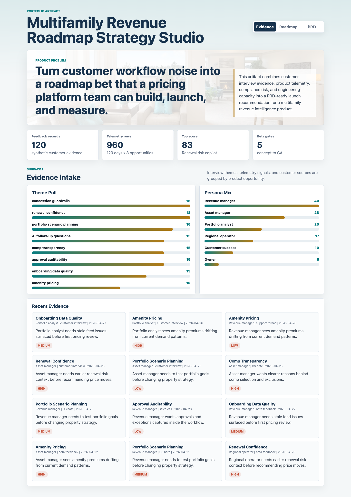
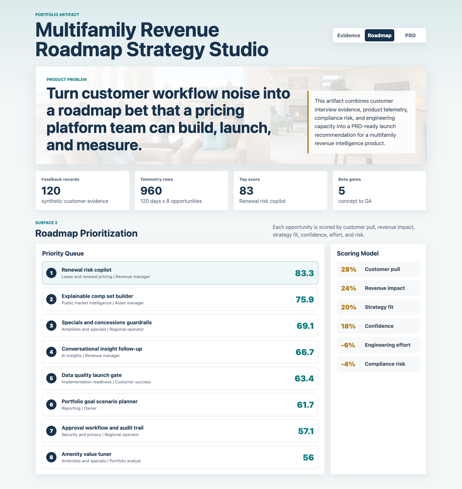
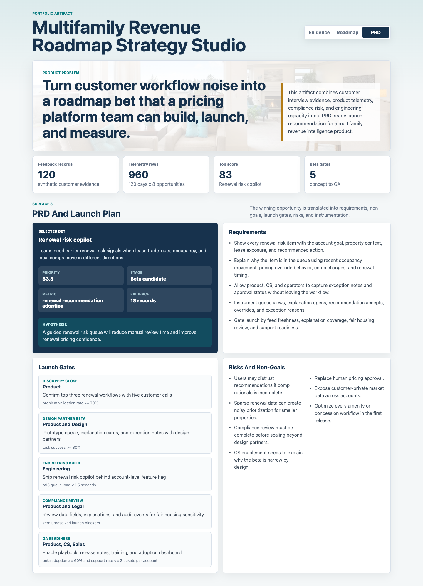

# Multifamily Revenue Roadmap Strategy Studio

This project is a product-management strategy artifact for a multifamily revenue intelligence platform. It shows how customer evidence, product telemetry, compliance risk, and engineering capacity can be converted into a roadmap recommendation, PRD brief, and beta-to-GA launch plan.

The artifact is intentionally not just a dashboard. It is built to demonstrate product judgment: identifying a customer problem, scoring roadmap options, selecting a narrow product bet, defining requirements, and planning launch readiness.

## Screenshots



*Evidence Intake: customer interviews, customer success notes, sales calls, support threads, and beta feedback are grouped into themes, personas, and recent evidence records.*



*Roadmap Prioritization: product opportunities are ranked with a transparent weighted model across customer pull, revenue impact, strategy fit, confidence, engineering effort, and compliance risk.*



*PRD And Launch Plan: the top opportunity is translated into requirements, non-goals, launch gates, risks, owners, and success metrics.*

## What The Artifact Shows

- A product evidence intake for multifamily revenue workflows.
- A ranked roadmap queue for lease pricing, renewal pricing, public comps, concessions, amenities, data quality, approval workflows, and AI insight follow-up.
- A PRD-ready brief for the highest-priority opportunity, Renewal risk copilot.
- A beta-to-GA plan with cross-functional owners and launch gates.
- A repeatable synthetic data generation script that supports the artifact.

## Data Sources

This project uses synthetic but workflow-shaped data because customer interviews, private portfolio telemetry, pricing recommendations, and launch-readiness notes are not public data.

The synthetic data is generated by `scripts/score_operating_data.py` with deterministic random seeds. It models realistic product-management structures:

- Customer evidence from interviews, customer success notes, sales calls, support threads, and beta feedback.
- Personas including revenue managers, asset managers, regional operators, portfolio analysts, owners, and customer success.
- Product themes including renewal confidence, comp transparency, concession guardrails, amenity pricing, portfolio scenario planning, onboarding data quality, approval auditability, and AI follow-up questions.
- Product telemetry including pricing recommendation adoption, override rate, explainability engagement, approval latency, manual export count, and data freshness.
- Roadmap scoring across customer pull, revenue impact, strategy fit, confidence, engineering effort, and compliance risk.

The data does not represent real customer performance, real company performance, or any production system.

## Analysis Outputs

- `analysis/executive_findings.md`
- `analysis/analysis_plan.md`
- `analysis/sql_checks.sql`
- `analysis/outputs/roadmap_priority.csv`
- `analysis/outputs/launch_plan.csv`
- `analysis/outputs/app_payload.json`

## Role Connection

This artifact demonstrates the work expected from a product manager on a data-heavy B2B SaaS product:

- Translating customer feedback into product requirements.
- Prioritizing roadmap work against customer need, strategic value, engineering effort, and risk.
- Collaborating across product, design, engineering, customer success, sales, and legal.
- Moving from discovery to beta to general availability with clear success metrics.
- Using product usage data and customer workflows to inform decisions.

## Scope

What this artifact does:

- Creates a defensible PM work product for a multifamily revenue intelligence platform.
- Generates synthetic data and analysis outputs locally.
- Provides three distinct product surfaces for review and screenshots.
- Documents the assumptions behind the data and scoring model.

What this artifact does not do:

- It does not connect to real customer, property, or pricing data.
- It does not make live rent recommendations.
- It does not replace compliance, legal, or fair housing review.
- It does not claim production impact.

## Run Locally

```bash
npm run analyze
npm start
```

Then open `http://localhost:4173`.
